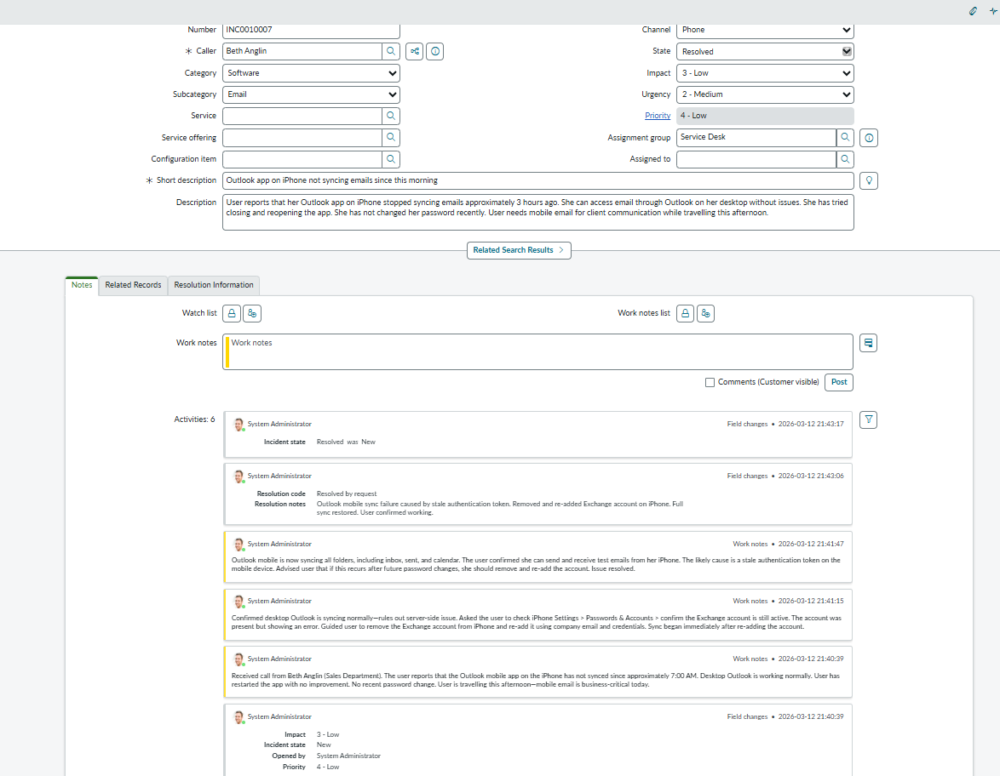

# Ticket 1 — Outlook Mobile Sync Failure

| Field | Value |
|-------|-------|
| **Incident** | INC0010007 |
| **Caller** | Beth Anglin (Sales Department) |
| **Channel** | Phone |
| **Category** | Software > Email |
| **Impact** | 3 — Low (single user) |
| **Urgency** | 2 — Medium (user cannot use mobile email) |
| **Priority** | P4 — Low |
| **State** | Resolved |

---

## Scenario

User reported Outlook app on iPhone stopped syncing emails. Desktop Outlook was working normally. User needed mobile email for client communication while travelling.

---

## Troubleshooting

- Confirmed desktop Outlook syncing normally — ruled out server-side issue
- Guided user to check iPhone Settings > Passwords & Accounts
- Exchange account was present but showing error
- Removed and re-added Exchange account using company credentials
- Sync restored immediately after re-adding

---

## Root Cause

Stale authentication token on mobile device.

---

## Resolution

Removed and re-added Exchange account on iPhone. Full sync restored. Advised user to update saved credentials after future password changes.

---

## Screenshot

