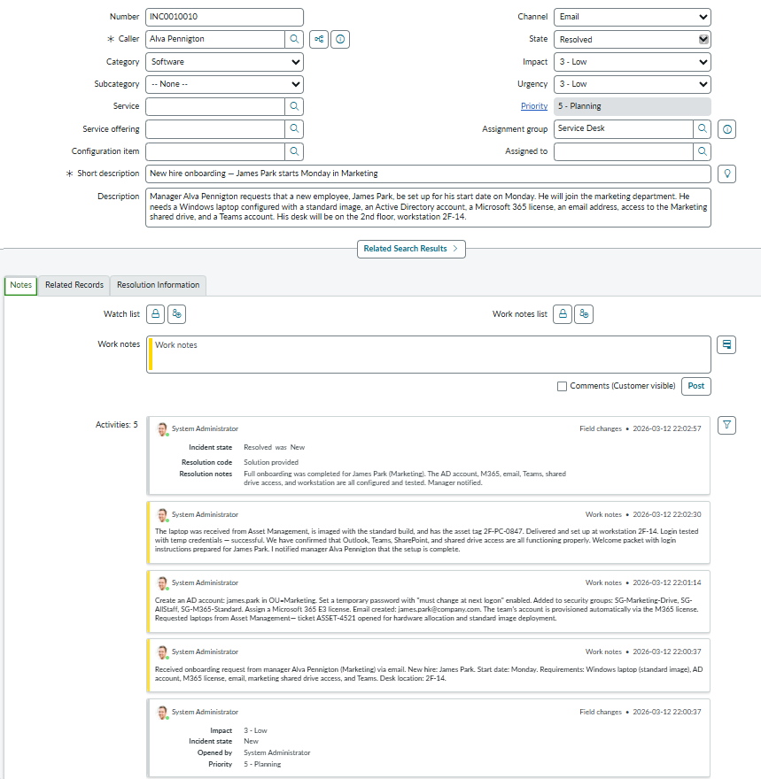

# Ticket 4 — New Hire Onboarding (Service Request)

| Field | Value |
|-------|-------|
| **Incident** | INC0010010 |
| **Caller** | Alva Pennington (Marketing Manager) |
| **Channel** | Email |
| **Category** | Software |
| **Impact** | 3 — Low |
| **Urgency** | 3 — Low |
| **Priority** | P5 — Planning |
| **State** | Resolved |

---

## Scenario

Manager requested full onboarding setup for new hire James Park starting Monday in Marketing. Requirements: Windows laptop (standard image), AD account, Microsoft 365 license, email, Marketing shared drive access, Teams, workstation setup at 2F-14.

---

## Actions Taken

- Created AD account (james.park) in OU=Marketing with temporary password (must change at next logon)
- Added to security groups: SG-Marketing-Drive, SG-AllStaff, SG-M365-Standard
- Assigned Microsoft 365 E3 license; email created (james.park@company.com)
- Teams account provisioned automatically via M365 license
- Requested laptop from Asset Management (ticket ASSET-4521)
- Received laptop, imaged with standard build (asset tag 2F-PC-0847)
- Delivered and configured at workstation 2F-14
- Tested login, Outlook, Teams, SharePoint, and shared drive access — all confirmed working
- Welcome packet with login instructions prepared
- Manager notified that setup is complete

---

## Resolution

Full onboarding completed. All systems configured, tested, and confirmed working.

---

## Screenshot

