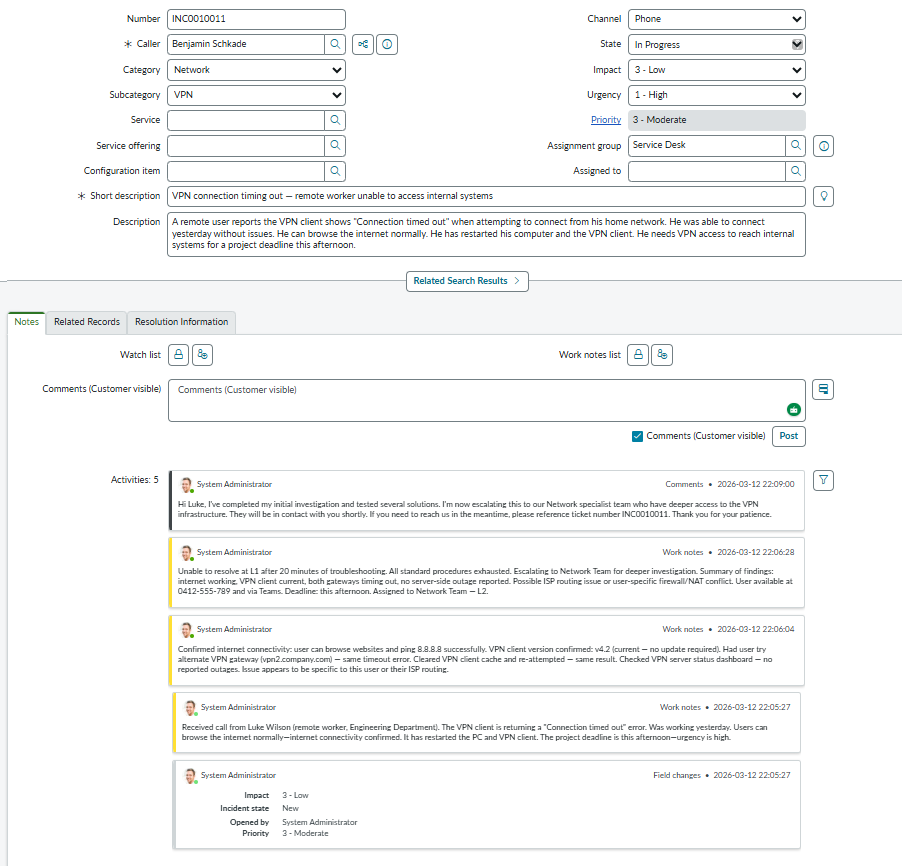

# Ticket 5 — VPN Connection Failure (Escalated to L2)

| Field | Value |
|-------|-------|
| **Incident** | INC0010011 |
| **Caller** | Benjamin Schkade (Engineering Department) |
| **Channel** | Phone |
| **Category** | Network > VPN |
| **Impact** | 3 — Low (single user) |
| **Urgency** | 1 — High (project deadline today) |
| **Priority** | P3 — Moderate |
| **State** | In Progress (Escalated to Network Team — L2) |

---

## Scenario

Remote user reported VPN client returning "Connection timed out" error. Was working yesterday. Internet connectivity confirmed. User restarted PC and VPN client. Project deadline same afternoon.

---

## Troubleshooting (L1)

- Confirmed internet connectivity: user can browse websites and ping 8.8.8.8 successfully
- VPN client version confirmed current (v4.2)
- Attempted alternate VPN gateway (vpn2.company.com) — same timeout error
- Cleared VPN client cache and re-attempted — same result
- Checked VPN server status dashboard — no reported outages
- Issue appears specific to this user or their ISP routing

---

## Escalation

Unable to resolve at L1 after 20 minutes. All standard procedures exhausted. Escalated to Network Team with full summary of findings. Possible ISP routing issue or user-specific firewall/NAT conflict. User contact details and deadline included in handoff notes.

---

## Customer Communication

User notified of escalation via customer-visible comment with ticket reference number and next steps.

---

## Screenshot

